# Kasa Chat v2 — Architecture

> **Living document.** This reflects the system *as built right now*. Update it at the end of every phase (see [Decisions Locked](plan.md) / [plan.md](plan.md)). Mermaid diagrams render inline on GitHub.

**Current state:** Phase 0 ✅ · Phase 1 ✅ · Phase 2 ✅ · Phase 3 ✅ · Phase 4 ✅ · Phase 5 ✅ · Phase 6 ✅ · Phase 7 ✅ · Phase 8 ✅ · Phase 9 ✅ · Phase 10 ✅ · Phase 11 🔜 (deploy + README)

---

## 1. What this is

A 1-to-1 (DM-only, no rooms) real-time MERN chat app with an `@ai` assistant powered by Google Gemini. Users sign in, pick someone from the sidebar, and exchange text/image messages in real time over Socket.IO. Typing a message that starts with `@ai` triggers a Gemini-backed bot that replies into the same DM.

The bigger arc (embeddings, vector search, RAG, Redis cache / rate-limit / presence) is laid out in [plan.md](plan.md). This file tracks what exists.

---

## 2. Tech stack (as built)

| Layer | Choice | Notes |
|---|---|---|
| Frontend | React 19 + Vite + Tailwind + daisyUI | SPA, `react-router-dom` 7 |
| State | Zustand | `useAuthStore`, `useChatStore`, `useThemeStore` |
| Realtime (client) | `socket.io-client` | one socket per logged-in user |
| HTTP (client) | `axios` | `withCredentials` for the JWT cookie |
| Backend | Node + Express 5 | ES modules (`"type": "module"`) |
| Realtime (server) | Socket.IO 4 | `userSocketMap` for message routing; **Redis** for presence (Phase 10) |
| Auth | JWT in an httpOnly cookie | `bcryptjs` hashing |
| Database | MongoDB Atlas + Mongoose 8 | `User`, `Message` collections |
| LLM | Google Gemini (`@google/generative-ai`) | model `gemini-2.5-flash-lite` — switched off `gemini-2.5-flash` after hitting its **20 requests/day** free-tier cap; `1.5` is retired and `2.0-flash` returns `limit: 0` on this key. Lite has a much higher daily limit and is plenty for chat + short RAG answers. |
| Embeddings | `@xenova/transformers` (`all-MiniLM-L6-v2`, 384-dim) | runs locally via ONNX, no API/cost; model loads once (~7s cold), then ~2ms/call |
| Cache + rate limit | Redis (`ioredis`) via Docker | one shared client ([lib/redis.js](backend/src/lib/redis.js)) on **port 6380** (6379 taken by another project). Caches `@ai` answers (1-hr TTL, Phase 8) and runs the sliding-window rate limiter (atomic Lua over a sorted set, Phase 9). |
| Image uploads | Cloudinary | base64 → secure URL |

---

## 3. System at a glance

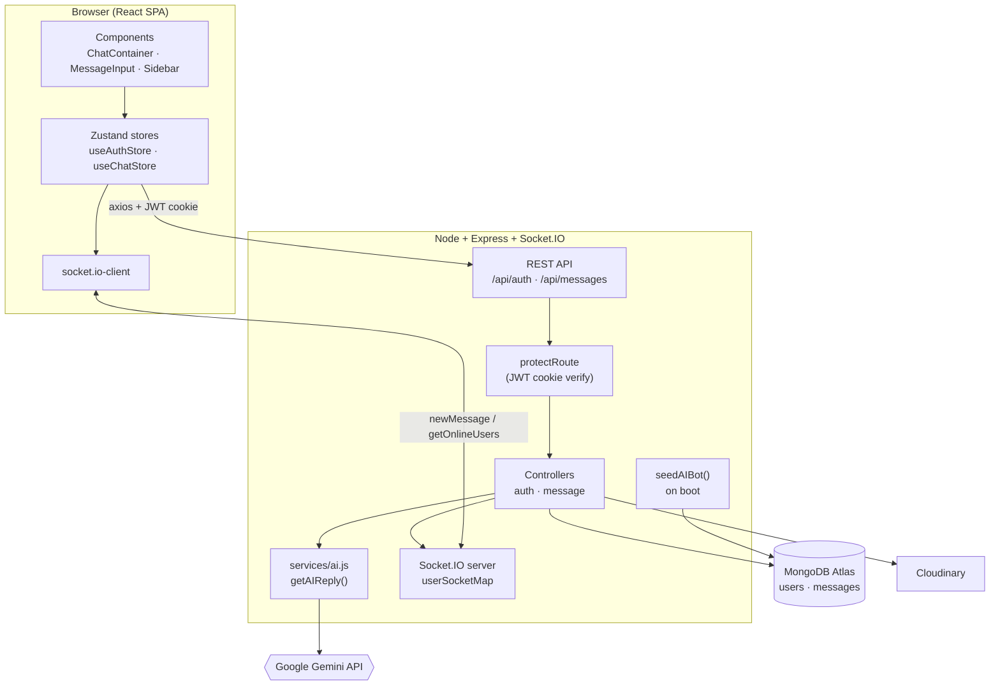

---

## 4. Repository layout

```
KASA-CHAT/
├── plan.md                      # the full roadmap (phases 0–11)
├── learnings.md                 # per-phase reflections (the real deliverable)
├── architecture.md              # ← this file
├── backend/
│   ├── scripts/test-gemini.js   # Phase 0 hello-world Gemini check
│   └── src/
│       ├── index.js             # express app, route mounting, boot → connectDB + seedAIBot
│       ├── controllers/
│       │   ├── auth.controller.js     # signup/login/logout/updateProfile/checkAuth
│       │   └── message.controller.js  # getUsers / getMessages / sendMessage (+ @ai branch)
│       ├── services/ai.js       # getAIReply(text) → Gemini  [Phase 1]
│       ├── seeds/
│       │   ├── ai-bot.seed.js   # upserts the "AI Bot" user, caches its _id
│       │   └── user.seed.js
│       ├── models/
│       │   ├── user.model.js     # email, fullName, password, profilePic, isBot
│       │   └── message.model.js  # senderId, receiverId, text, image, isBot, conversationWith
│       ├── middleware/auth.middleware.js  # protectRoute (JWT cookie)
│       ├── routes/               # auth.route.js · message.route.js
│       └── lib/                  # db.js · socket.js · cloudinary.js · utils.js (JWT)
└── frontend/
    └── src/
        ├── store/                # useAuthStore · useChatStore · useThemeStore
        ├── components/           # ChatContainer · ChatHeader · MessageInput · Sidebar · Navbar …
        └── pages/                # Home · Login · SignUp · Profile · Settings
```

---

## 5. Data models

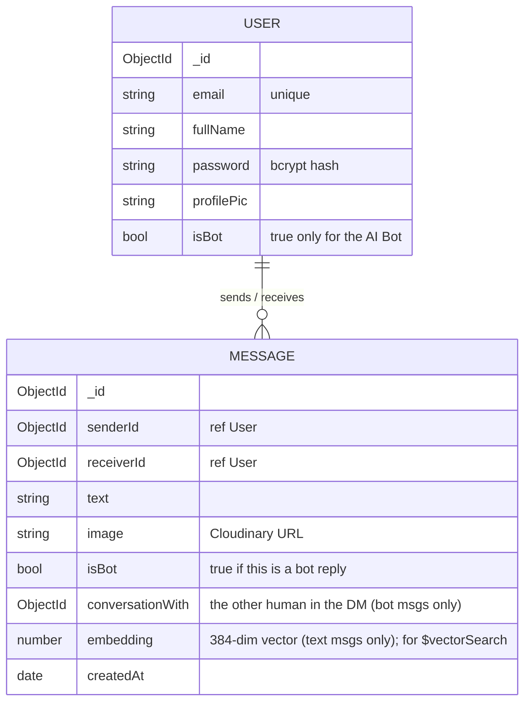

### The bot-message asymmetry (important)

Human↔human messages are symmetric: `senderId` / `receiverId` are the two people. **Bot replies are stored asymmetrically** and this shapes every query:

| Field | Value on a bot reply |
|---|---|
| `senderId` | the AI Bot's `_id` |
| `receiverId` | the human who typed `@ai` |
| `isBot` | `true` |
| `conversationWith` | the *other* human in that DM |

Because of this, reconstructing a full DM transcript needs a **3-clause `$or`** ([getMessages](backend/src/controllers/message.controller.js#L25-L31)):

```js
$or: [
  { senderId: myId,         receiverId: userToChatId },        // me → them
  { senderId: userToChatId, receiverId: myId },                // them → me
  { isBot: true, receiverId: myId, conversationWith: userToChatId }, // bot replies in this DM
]
```

This same filter is the basis for the Phase 2 history query (§8).

---

## 6. Key flows

### 6.1 Auth (JWT in httpOnly cookie)

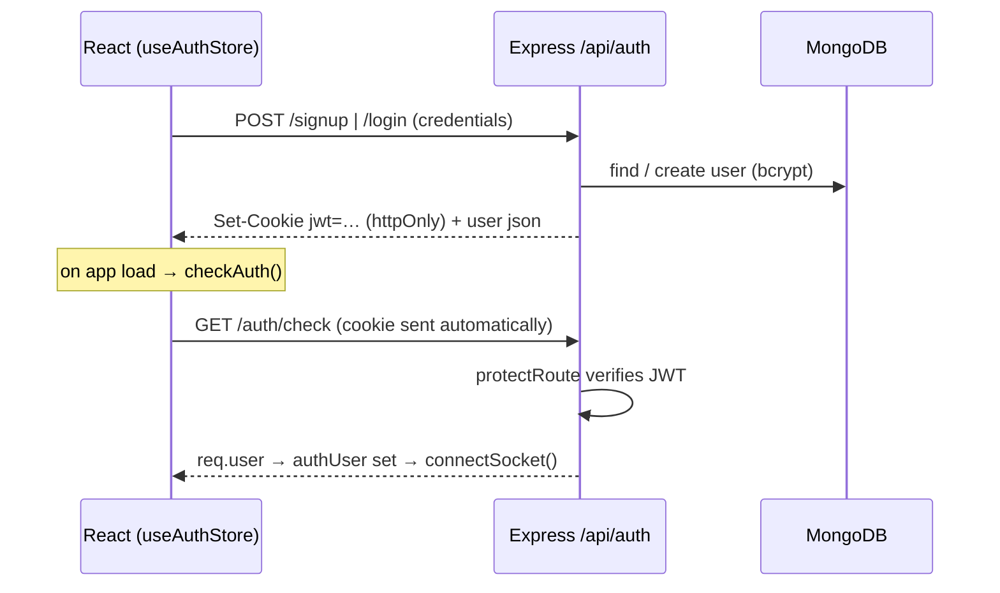

### 6.2 Realtime presence (Phase 10 — Redis-backed)

Presence now lives in **Redis**, so the online list survives restarts and is shared across multiple Node processes. The local `userSocketMap` stays — but only for its *other* job.

**Two jobs, split:**
- **Message routing** → still local `userSocketMap` ([socket.js](backend/src/lib/socket.js)) + `getReceiverSocketId`. Socket IDs are process-local, so this *can't* move to Redis without the Socket.IO Redis adapter (out of scope). Cross-*process* message delivery is therefore not solved here — only presence is.
- **Presence (who's online)** → Redis ([services/presence.js](backend/src/services/presence.js)).

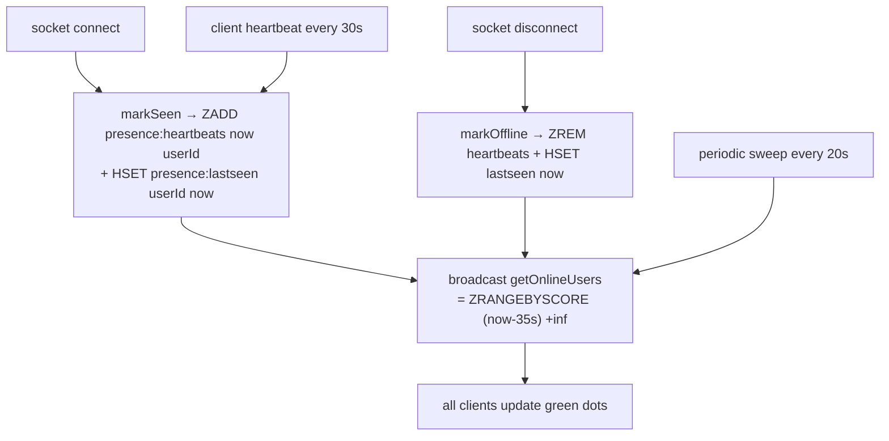

- **Sorted set `presence:heartbeats`** (score = last-heartbeat ms): online = score within 35s. This gives per-user liveness (zombies age out by score — Redis sets can't TTL individual members) *and* last-seen for free.
- **Hash `presence:lastseen`** (userId → ts) → powers "last seen 5 min ago" for offline users.
- **Client heartbeat every 30s** ([useAuthStore.js](frontend/src/store/useAuthStore.js)) refreshes the liveness window → a crashed/zombie connection (no `disconnect` event) auto-expires in ~35s. *Why a separate heartbeat when Socket.IO already pings?* The socket ping keeps the *transport* alive to one server; our heartbeat refreshes the *shared Redis record* any server can read — different layers.
- **Periodic sweep (20s)** rebroadcasts the online list so TTL-expired zombies also drop off everyone's green dots (no event fires for those).
- **`GET /api/presence`** → `{ online, lastSeen }`. Degrades gracefully (returns empty) if Redis is down.
- **Honest "why":** not faster (in-memory was already instant) — it **survives restarts** and **works across processes**. Verified live: a user connected to one process showed online via `/api/presence` queried from a *second* process.
- **Known edge:** multi-tab — one tab closing calls `markOffline`, but another tab's heartbeat re-marks online within 30s (self-heals). Pre-existing behavior, not worsened.

### 6.3 Send a message + the `@ai` bot (Phase 1)

This is the heart of the current AI integration ([sendMessage](backend/src/controllers/message.controller.js#L40-L99)). Note the **fire-and-forget** pattern: the HTTP response returns immediately, and the Gemini round-trip happens after, pushed over sockets.

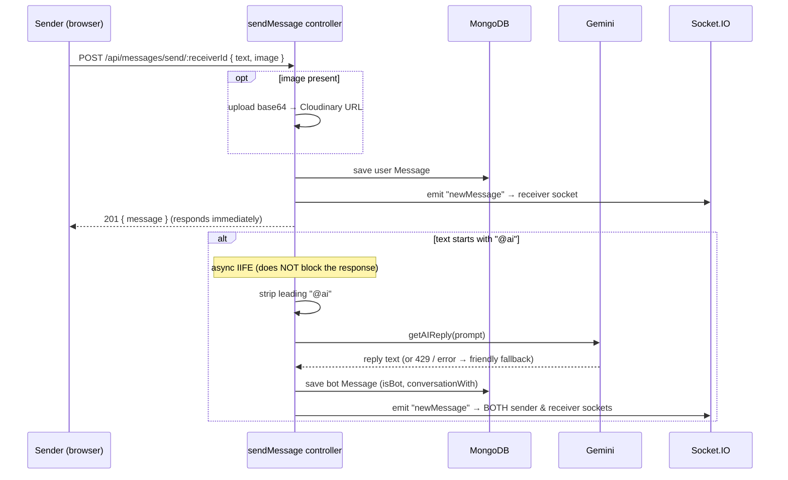

**Decision flowchart** — the same `sendMessage` logic as branching decisions (easier to trace against the code than the timeline above):

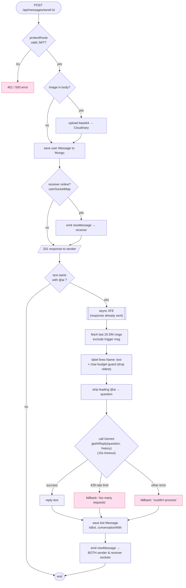

**Client side:** `useChatStore.subscribeToMessages()` filters incoming `newMessage` events — it accepts a message if it's from the currently selected user, **or** if it's a bot message whose `conversationWith` matches the open chat ([useChatStore.js](frontend/src/store/useChatStore.js#L56-L63)). `ChatContainer` renders bot bubbles with a 🤖 avatar and purple styling ([ChatContainer.jsx](frontend/src/components/ChatContainer.jsx#L59-L83)).

### 6.4 The `@ai` service (Phase 2 — context-aware)

[services/ai.js](backend/src/services/ai.js) now takes recent history and builds a structured prompt:

```js
getAIReply(question, history)   // history = chronological [{ name, text }]
```

- A `systemInstruction` (role + "only answer the latest question") sits at the top of the prompt.
- `buildTranscript()` renders history as labeled lines (`Name: text`) and **drops the oldest lines** if the transcript exceeds ~6000 chars.
- The question is pinned at the bottom (`Latest question: …`) for recency.
- The Gemini call is wrapped in a **15s timeout** (`Promise.race`); `response.text()` is allowed to throw on safety-blocked replies so the controller returns a friendly fallback.

The controller is what fetches and labels the history (`ai.js` never touches Mongo) — see the §6.3 flowchart.

### 6.5 The embedding service (Phase 4)

[services/embedding.js](backend/src/services/embedding.js) turns text into a 384-number vector that captures *meaning*, locally — no API, no cost.

```js
getEmbedding(text)        // → number[384]  (mean-pooled, normalized)
warmUpEmbeddings()        // load model once on boot; returns ms taken
```

- Model: `Xenova/all-MiniLM-L6-v2`, run via ONNX inside `@xenova/transformers`.
- The model is loaded **once** (the `pipeline()` promise is cached) and reused; loading per call would be unusably slow.
- **Cold start ~7s** (first load) vs **~2ms warm** — so [index.js](backend/src/index.js#L38) calls `warmUpEmbeddings()` on boot, before any user request.
- Vectors are **normalized**, so cosine similarity reduces to a dot product (matters for the Phase 5 index config).

**Where embeddings get created:**
- **Inline on save** — [sendMessage](backend/src/controllers/message.controller.js) embeds the text of both the user message and the bot reply before saving (skipped for image-only messages). Wrapped in try/catch so an embedding failure never blocks the send. ("Build dumb first" — inline, not a queue; a BullMQ queue is the 10×-write-load upgrade, deliberately deferred.)
- **Backfill** — [scripts/backfill-embeddings.js](backend/scripts/backfill-embeddings.js) is a one-time, idempotent pass that embeds pre-existing messages that have none.

> Verified: 384-dim output; cosine sim "refund" ↔ "money back" = **0.742** vs "refund" ↔ "cake recipe" = **0.021** — clear semantic separation, the basis for Phase 5 search.

### 6.6 Semantic search (Phase 5)

`POST /api/search` ([search.controller.js](backend/src/controllers/search.controller.js), [search.route.js](backend/src/routes/search.route.js)) finds messages by *meaning* using MongoDB Atlas `$vectorSearch`. Protected by `protectRoute`.

```mermaid
flowchart TD
  Q([POST /api/search { query }]) --> Auth{protectRoute<br/>valid JWT cookie?}
  Auth -- no --> R401[401]
  Auth -- yes --> Embed["getEmbedding(query)<br/>→ 384-dim vector"]
  Embed --> VS["$vectorSearch (Atlas index 'vector_index')<br/>numCandidates: 100, limit: 5<br/>filter: senderId OR receiverId == me"]
  VS --> Proj["$project: text, sender, score<br/>(strip raw embedding)"]
  Proj --> Resp[/top 5 messages + similarity scores/]
```

Key points:
- **Same model both sides** — the query is embedded with the *same* `getEmbedding` as the stored messages, so query and data share the 384-dim space.
- **ANN, not exact** — Atlas uses an HNSW index; `numCandidates: 100` examines 100 vectors and returns the best `limit: 5` (recall-vs-latency dial). Approximate is fine because the embeddings are already approximate.
- **`similarity: cosine`** in the index — vectors are normalized, so cosine = dot product.
- **User-scoped** — the `filter` (on the index's declared `senderId`/`receiverId` filter fields) restricts results to the caller's own conversations; you can't search other people's chats.
- **`$meta: "vectorSearchScore"`** returns the similarity; the raw 384-number vector is projected out of the response.

> Manual-search demo lives at [scripts/semantic-search-demo.js](backend/scripts/semantic-search-demo.js) — the same logic done in Node (no index), useful for understanding what Atlas does internally.

> Atlas index config: name `vector_index`, db `test`, collection `messages`, fields `embedding` (vector, 384, cosine) + `senderId`/`receiverId` (filter).

### 6.7 Search UI (Phase 6)

The frontend surfaces `/api/search` as a **modal overlay** (not an inline sidebar bar) — a deliberate choice for **mobile**: the sidebar collapses to an icon-only `w-20` rail on small screens, too narrow for a text input. A modal sizes to the screen and works identically on mobile and desktop.

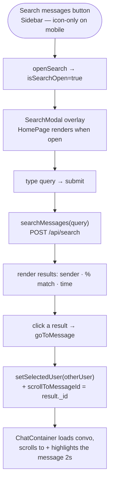

Wiring (all in [frontend/src/](frontend/src/)):
- **State/actions** in [useChatStore.js](frontend/src/store/useChatStore.js): `searchMessages`, `openSearch`/`closeSearch`, and `goToMessage` — which resolves the "other" participant (`isBot ? conversationWith : the non-me id`), switches conversation, and sets `scrollToMessageId`.
- **[SearchModal.jsx](frontend/src/components/SearchModal.jsx)** — input + loading/empty/error states + result list. Closes on Escape / backdrop click.
- **[Sidebar.jsx](frontend/src/components/Sidebar.jsx)** — the trigger button (centered icon on mobile, labeled on desktop).
- **[ChatContainer.jsx](frontend/src/components/ChatContainer.jsx)** — when `scrollToMessageId` is set, it scrolls to `#msg-<id>` and highlights it; the normal scroll-to-bottom is suppressed during that navigation.

UX decisions (the Phase 6 learning questions):
- **Score shown** as "N% match" — for a portfolio piece it signals the feature is semantic/AI-powered. (In a consumer product you'd often hide it.)
- **Client-side scroll**, not a server deep-link — it's an SPA, everything's already in memory.
- **Empty-state copy** is precise — "No semantically similar messages found" — to teach users the search is by *meaning*, not keywords.

### 6.8 RAG Q&A — "Ask AI about this chat" (Phase 7)

The killer feature: ask a question about the open conversation → get a **grounded answer with clickable citations**, **streamed** in over SSE. It combines Phase 5 (retrieval) + Phase 2-style prompt building (generation).

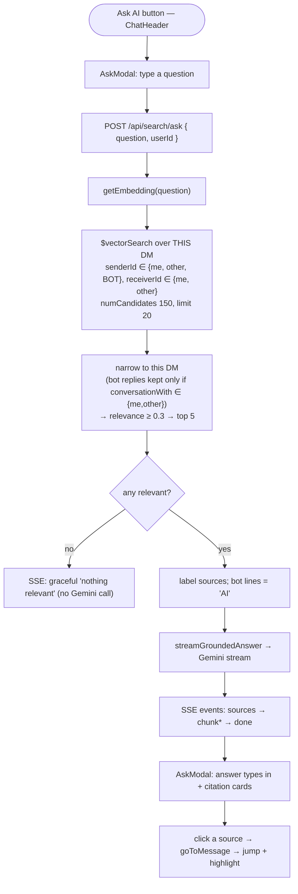

- **Backend** ([search.controller.js](backend/src/controllers/search.controller.js) `askAboutChat`, [ai.js](backend/src/services/ai.js) `streamGroundedAnswer`): retrieves candidates from the DM pair, narrows in code, builds a numbered/speaker-labeled grounded prompt, **streams** the answer over SSE (`event: sources` → `chunk`s → `done`).
- **Grounding:** the RAG system prompt says *use ONLY these messages, cite `[n]`, and if the answer isn't present reply "I couldn't find that in your chat."* — verified to refuse rather than hallucinate.
- **Includes the bot's own replies** (Phase 7 fix): bot messages have `senderId = bot`, so the filter adds the bot to the sender set and pulls 20 candidates, then keeps bot replies only when `conversationWith ∈ {me, other}` (so it doesn't leak bot answers from *other* DMs). Without this, "ask about this chat" missed everything the `@ai` bot had told you.
- **Weak-retrieval handling:** matches below 0.3 similarity are dropped; if none remain, it returns a graceful "nothing relevant" over SSE without calling Gemini.
- **Streaming** (off-plan addition; the plan had cut SSE): backend uses `generateContentStream`; the store consumes the SSE via `fetch` + a `ReadableStream` reader (axios can't stream) and grows `askAnswer` chunk-by-chunk with a blinking cursor in [AskModal.jsx](frontend/src/components/AskModal.jsx).
- **The recall-vs-reasoning win:** retrieval may rank an off-topic message first, but the LLM reads all 5 and reasons to the right cited answer (e.g. "Monday meeting" surfaced from rank 3).

> Manual eval (6/6 grounded & correct) lives in [learnings.md](learnings.md), not a separate `evals/` folder.

### 6.9 AI response cache (Phase 8)

[services/cache.js](backend/src/services/cache.js) caches `@ai` answers in Redis so identical questions skip Gemini.

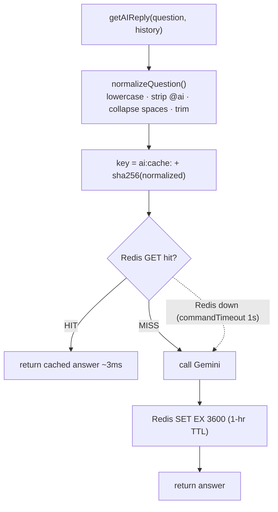

- **Cache-aside**: the code checks Redis, and on a miss fetches from Gemini and writes back. `get`/`set`/`normalizeQuestion` in [cache.js](backend/src/services/cache.js).
- **Key = `ai:cache:` + SHA-256 of the normalized question** — fixed-length, clean, and trivially-different phrasings ("What is 2+2?" vs "what is  2+2 ?") collapse to one entry.
- **1-hour TTL** (`SET ... EX 3600`). Verified: repeat question = HIT in ~3ms vs ~1300ms cold, zero Gemini call.
- **Graceful degradation**: `commandTimeout: 1000` + try/catch → if Redis is down, `get` returns null and the app falls back to Gemini (caching is an optimization, never a hard dependency).
- **Known tradeoff (deliberate):** the key is the *question only* — it ignores `history`. Great for general/factual repeats; a context-dependent question ("what's my dog's name?") could serve a stale answer across conversations. The correct-but-low-hit-rate fix (key on question + context) is noted in [learnings.md](learnings.md). Only `getAIReply` is cached, not RAG.
- **Ops note:** Redis runs in Docker (`kasa-redis` on 6380). After a machine restart: `docker start kasa-redis`.

### 6.10 Rate limiter on `@ai` (Phase 9)

[services/rateLimit.js](backend/src/services/rateLimit.js) caps each user at **5 `@ai` calls per minute** with a **sliding window**, implemented as a **single atomic Lua script** over a Redis **sorted set**.

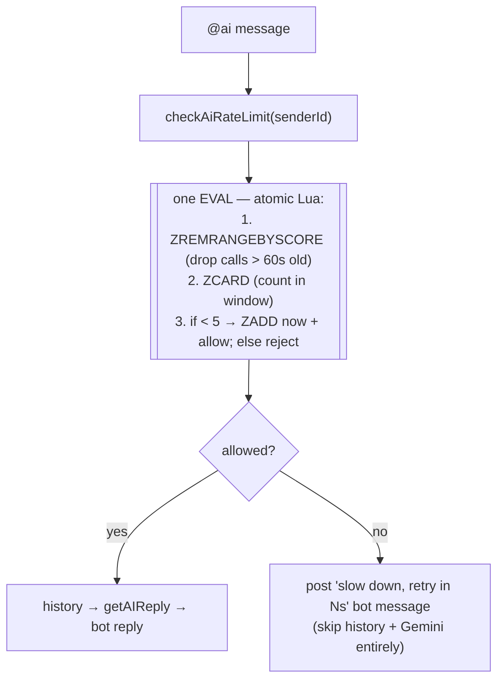

- **Sliding window, not fixed** — counts calls in the *last 60s from now*, so there's no fixed-bucket edge-burst (5 at 0:59 + 5 at 1:01).
- **Sorted set with timestamp-as-score** — `ZREMRANGEBYSCORE` expires old calls individually, `ZCARD` counts the window, `ZADD` records the call. A plain counter can't expire individual calls.
- **One atomic Lua `EVAL`** — the remove→count→add sequence runs uninterrupted inside Redis, so concurrent requests can't race the count (the gap a non-atomic version would leave). This is *why* Lua over `MULTI`/`EXEC`: Lua allows the conditional (`if count < limit`) atomically; a transaction can't branch mid-way.
- **Per-user key** `ratelimit:@ai:<userId>`, with `PEXPIRE` so idle keys self-clean.
- **Fail-open**: if Redis is down, `checkAiRateLimit` allows the request (don't block legit users on a limiter outage) — a deliberate availability-over-strictness choice.
- **Verified:** burst of 7 → first 5 allowed, 6th+ rejected with a retry-after.

---

## 7. Phase progress tracker

| Phase | Title | Status | Lands in |
|---|---|---|---|
| 0 | Setup (Gemini key, AI Bot seed, `isBot` field) | ✅ Done | `ai-bot.seed.js`, `test-gemini.js` |
| 1 | `@ai` bot MVP | ✅ Done | `services/ai.js`, `sendMessage` `@ai` branch, bot UI |
| 2 | **Conversation context** (last 20 msgs → structured prompt) | ✅ Done | `services/ai.js`, `sendMessage` |
| 3 | Embeddings concept (scratch only) | ✅ Done | — (learning-only) |
| 4 | Embed every message | ✅ Done | `services/embedding.js`, `embedding` field, backfill script |
| 5 | Vector search backend | ✅ Done | `POST /api/search`, Atlas `vector_index` |
| 6 | Search UI | ✅ Done | `SearchModal`, sidebar trigger, click-to-navigate |
| 7 | RAG Q&A | ✅ Done | `/api/search/ask`, `AskModal`, grounded + cited |
| 8 | Redis response cache | ✅ Done | `services/cache.js` (port 6380, 1-hr TTL) |
| 9 | Sliding-window rate limiter | ✅ Done | `services/rateLimit.js` (atomic Lua + sorted set) |
| 10 | Redis-backed presence | ✅ Done | `services/presence.js`, `socket.js`, `/api/presence`, heartbeat + last-seen UI |
| 11 | Polish / deploy / showcase | ⬜ | README, deploy |

---

## 8. Phase 2 — Conversation Context (✅ built)

**Goal:** the bot answers using recent DM history instead of a single isolated message.

**Decisions, as implemented** (rationale captured for the interview answers in [learnings.md](learnings.md)):

1. **Separation of concerns.** The controller owns Mongo; `ai.js` stays DB-agnostic. New signature: `getAIReply(question, history)` where `history` is a plain array `[{ name, text }]` the controller builds — not Mongoose docs.
2. **History query.** In the `@ai` branch (`me = senderId`, `other = receiverId`), reuse the §5.1 3-clause filter, `.sort({ createdAt: -1 }).limit(20)`, reverse to chronological, and **exclude the just-saved trigger message** (`newMessage._id`) — it's the *question*, not history.
3. **Labeled transcript, NOT native Gemini chat roles.** The DM is 3-party (two humans + bot). Gemini's `user`/`model` roles are 2-party and collapse both humans into `user`, destroying attribution. We build a labeled transcript so the bot knows *who said what*:
   ```
   Alice: when's the report due?
   Bob: Friday, end of day
   AI: ...
   Alice: @ai when is it due again?
   ```
   Names come from `fullName`; bot lines labeled `AI:`. This also serves the Phase 2 learning goal (prompt construction / instruction placement) and is the foundation for Phase 7 RAG.
4. **Include the bot's own past replies** in history (multi-turn memory; nearly free since `getMessages` already returns them — keeps the AI's memory consistent with the on-screen transcript).
5. **Prompt shape.** `systemInstruction` at the top (role + "only answer the latest question" + concision); labeled transcript in the middle; the question pinned at the **bottom** for recency.
6. **Context-size guard.** Primary cap = `limit(20)`. Secondary = a cheap char-budget guard that drops the oldest lines if the transcript is too long (no real tokenizer — "build dumb first").
7. **Error handling.** Keep the existing 429 / generic fallback; add a timeout wrapper around the Gemini call and guard `response.text()` against safety-blocked responses.

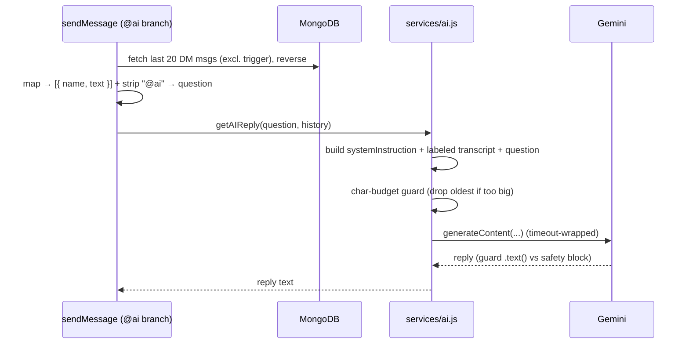

**Done when:** a multi-turn conversation where the bot correctly references earlier messages. ✅

**Next up — Phase 3 (Embeddings concept):** a scratch script comparing cosine similarity of related vs unrelated sentences. No app code yet — pure intuition-building before the embedding pipeline in Phase 4.

---

## 9. How to keep this doc honest

- Update the §7 tracker and add a flow/diagram at the **end of every phase**, in the same commit as the feature.
- When a diagram and the code disagree, the **code wins** — fix the diagram.
- New services (`embedding.js`, `cache.js`) get their own subsection under §6 when built.
- Keep the §2 "stack drift" callout current until the Gemini model version is reconciled.
